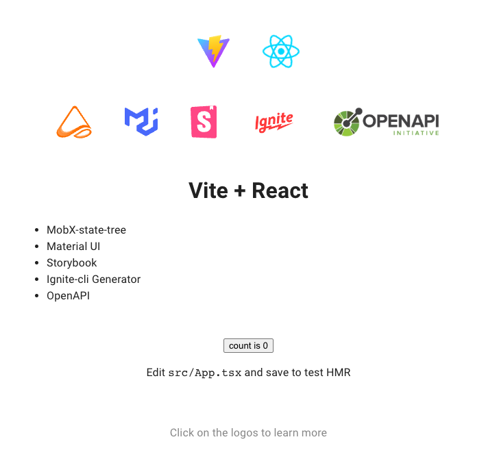

# React Boilerplate

## What is this?

- A boilerplate for React projects
- A starting point for new projects
- A reference for best practices

## How do I use it?

- Clone the repo
- Run `yarn install` to install dependencies
- Run `yarn start` to start the development server
- Open `http://localhost:3000` in your browser
- Or run `yarn storybook` to start the storybook server
- Open `http://localhost:6006` in your browser

## How do I create OpenAPI clients?

- You can generate an OpenAPI client using `yarn gen:openapi <path-to-openapi-spec>`.
- When creating an OpenAPI client by executing `yarn gen:openapi ./openapi-docs/petstore3.0.3.yml`. Create a service and model based on the OpenAPI specification in the `./openapi-docs/petstore3.0.3.yml` file.
- You can also use 'yarn gen:openapi https://petstore3.swagger.io/api/v3/openapi.json'

## How do I contribute?

- Fork the repo
- Create a feature branch
- Commit your changes
- Push to your fork
- Create a pull request

## License

- MIT

## Credits

- [React](https://reactjs.org/)
- [Vite](https://vitejs.dev/)
- [React Router](https://reactrouter.com/en/main)
- [MobX-State-Tree](https://mobx-state-tree.js.org/intro/welcome)
- [TypeScript](https://www.typescriptlang.org/)
- [InfiniteRed Ignite](https://github.com/infinitered/ignite)
- [Storybook](https://storybook.js.org/)
- [OpenAPI Specification 3](https://swagger.io/specification/)
